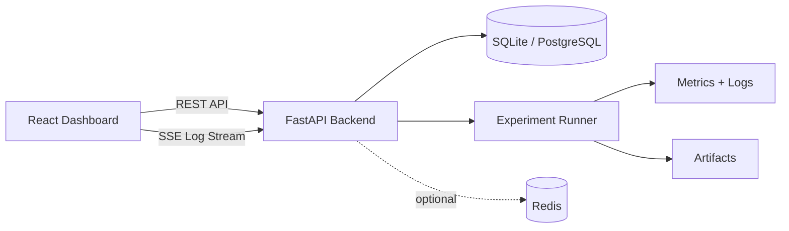
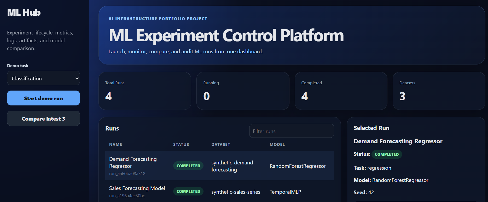
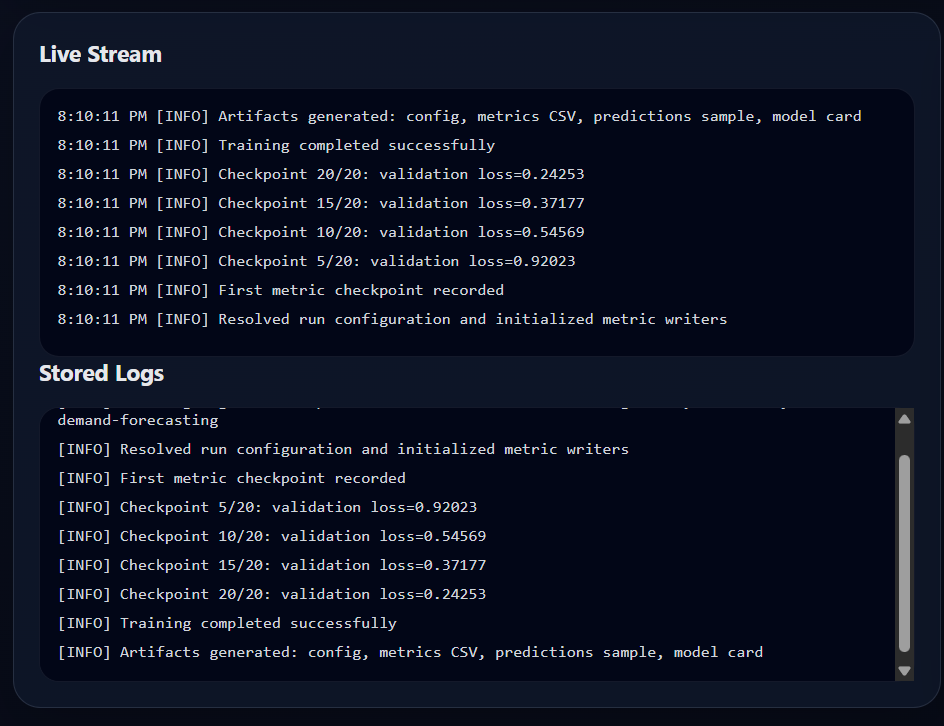
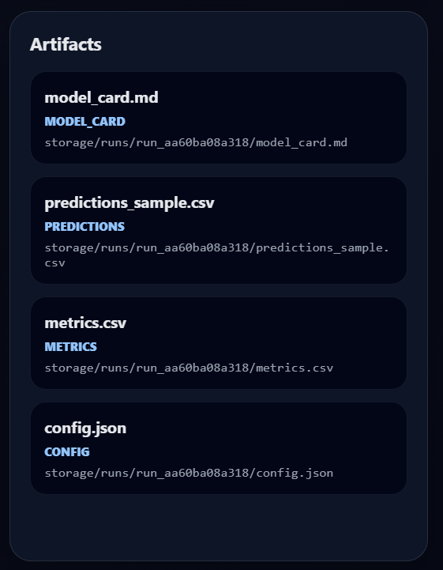
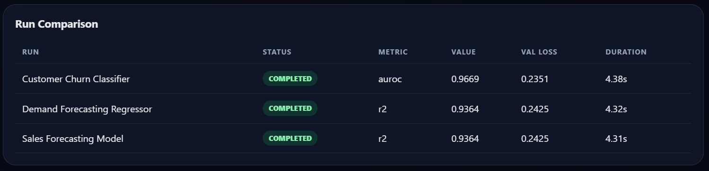

# ML Experiment Tracking Platform

A full-stack internal ML platform for launching experiments, tracking metrics, streaming logs, comparing runs, and browsing generated artifacts.

This project is designed as an internal ML workflow observability platform for experiment tracking, metric monitoring, run comparison, and artifact management. It combines backend API design, frontend product engineering, experiment lifecycle tracking, persistence, real-time updates, Docker, CI, and Kubernetes-ready deployment manifests.

## Core Features

- Launch demo ML experiments from a React dashboard
- Track run metadata, status, config, seeds, and timestamps
- Persist metric history for classification, regression, and forecasting tasks
- Stream structured logs with Server-Sent Events
- Compare multiple runs side-by-side
- Browse generated artifacts: config, metrics CSV, model card, predictions sample
- FastAPI backend with OpenAPI docs
- React + TypeScript dashboard with filters, cards, charts, logs, and comparison view
- SQLAlchemy persistence with SQLite locally and PostgreSQL in Docker
- Redis-ready configuration for status/cache extensions
- Docker Compose setup for backend, frontend, PostgreSQL, and Redis
- GitHub Actions CI for backend tests and frontend build
- Kubernetes manifests for backend/frontend deployment

## Tech Stack

**Backend:** Python, FastAPI, SQLAlchemy, Pydantic, SQLite/PostgreSQL, pytest  
**Frontend:** React, TypeScript, Vite, CSS, SVG charts  
**Infra:** Docker, Docker Compose, GitHub Actions, Kubernetes manifests

## Architecture



## Screenshots






## Quick Start: Local Backend

```bash
cd backend
python -m venv .venv
source .venv/bin/activate   # Windows: .venv\Scripts\activate
pip install -r requirements.txt
uvicorn app.main:app --reload --port 8000
```

API docs: http://localhost:8000/docs

## Quick Start: Frontend

```bash
cd frontend
npm install
npm run dev
```

Dashboard: http://localhost:5173

## Quick Start: Docker Compose

```bash
docker compose up --build
```

Backend: http://localhost:8000  
Frontend: http://localhost:5173

## Main API Endpoints

| Method | Endpoint                   | Purpose                     |
| ------ | -------------------------- | --------------------------- |
| GET    | `/health`                  | Health check                |
| POST   | `/runs`                    | Create a run                |
| POST   | `/runs/demo/start`         | Create and start a demo run |
| POST   | `/runs/{run_id}/start`     | Start an existing run       |
| GET    | `/runs`                    | List runs                   |
| GET    | `/runs/{run_id}`           | Run detail                  |
| GET    | `/runs/{run_id}/metrics`   | Metric history              |
| GET    | `/runs/{run_id}/logs`      | Structured logs             |
| GET    | `/runs/{run_id}/artifacts` | Generated artifacts         |
| GET    | `/compare?ids=id1,id2`     | Compare runs                |
| GET    | `/events/{run_id}`         | Stream logs with SSE        |

## Future Improvements

1. Replace synthetic demo training with a real PyTorch or TensorFlow model.
2. Add GPU utilization metrics using NVIDIA SMI.
3. Add PostgreSQL indexes and Redis caching for high-volume runs.
4. Add authentication with JWT or API keys.
5. Deploy the backend/frontend to Kubernetes locally using Minikube.
6. Add model artifact upload to S3/MinIO.
7. Add a queue worker using Celery/RQ for long-running training jobs.
